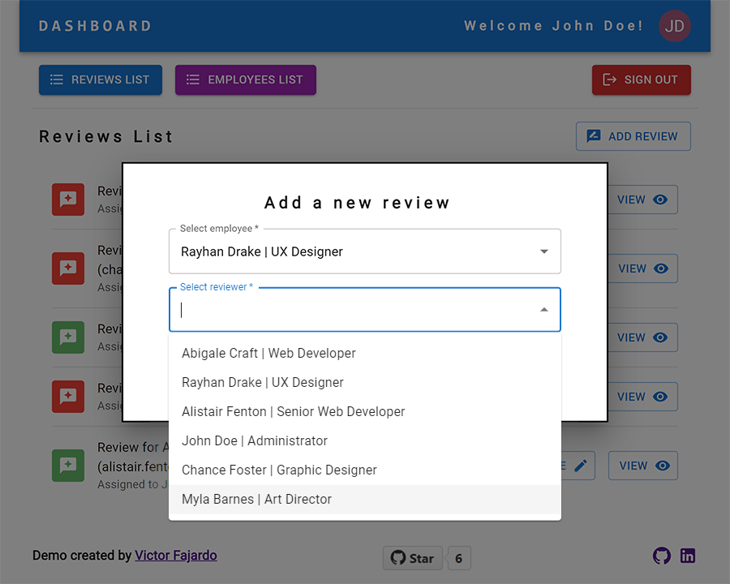

<h2 align="center">Employee Feedback App Prototype</h2>

<p align="center">
   
</p>

<h4 align="center">
  
  Architect designed and developed by <a href="mailto:fajardo.de.leon@gmail.com">Victor Fajardo</a><br />
  [ <a href="https://www.linkedin.com/in/victorfajardo/" target="_blank">linkedin.com/in/victorfajardo</a> | <a href="https://github.com/VictorFajardo" target="_blank">github.com/VictorFajardo</a> | <a href="https://stackshare.io/victorfajardo/software-engineering" target="_blank">stackshare.io/victorfajardo</a> ]
</h4>

---

App that allows employees to view/add/edit reviews on other employees. Managers can view/add/edit/delete employees and feedback reviews.

The app use Google Firebase as API to authentificate users (user/password) and save all the information to be displayed/edited/deleted (users and reviews collections).

Development stack:\
Typescript | Create React App | Redux Toolkit | React Router | Material UI | Firebase Auth | Firebase Database

## 🚀 Live Demo

Please visit the demo here:
https://employee-feedback-app.netlify.app/

### Admin Access

To access to the admin panel use the following user/password combination:\

```
john.doe@email.com
123456
```

To access to the admin panel use any of the users email with '123456' as password, e.g.:\

```
myla.barnes@email.com
123456
```

### Panels

<p align="center">
  
  <br /><br />
  
  <br /><br />
  
  <br /><br />
  
  <br /><br />
  
  <br /><br />
  
  <br /><br />
  
  <br /><br />
  
</p>

## Assumptions

- Only admins can create/view/update/delete users (including password).
- Only admins can create/view/update and assign reviews.
- Each review has a singular employee/reviewer assignment. (Multiples reviewers per review will requiere some adjusment into the logic).
- After a review is created the _review id_ is added to the user assigned to perform the review. All the reviews assigned to a reviewer will be showed on the reviewer dashboard.
- Reviewers can sign in into the app and review/submit all the reviews assigned to them.

Database reviews collection extructure

```
Review {
  id: string,
  createdAt: string,
  employeeName: string,
  employeeJobTitle: string,
  employeeEmail: string,
  reviewerName: string,
  reviewerJobTitle: string,
  reviewerEmail: string,
  content: string,
  completed: boolean,
}
```

Database users collection extructure

```
User {
  id: string,
  createdAt: string,
  firstName: string,
  lastName: string,
  jobTitle: string,
  email: string,
  password: string,
  confirmPassword: string,
  admin: boolean,
  reviews: string[],
}
```

## App user/admin access

The app verify if a user is logged (Firebase Auth), if the user is logged in the browser the app skip the login page and is redirected to the dashboard. Otherwise, the login screen is displayed.
If the user is an admin all the features and views are availables, for regular users only the list of reviews assigned to them will be displayed.

## Redux/Api Logic

After any successfully Api call (create/update/delete) the reducers update the data to reflect the changes into the app.

## Issues

The library for Firebase have some limitations in the front-end.

- Update user's email is disabled, in order to update an auth user (not just data users) from Firebase the SDK is needed.\
  _Solution: Implement a Node.js server to manage the SDK script to complete this task._

- Delete users is disabled, in order to delete an auth user (not just data users) from Firebase the SDK is needed.\
  _Solution: Implement a Node.js server to manage the SDK script to complete this task._

- Creating a new user automatically login into that user, this can not be prevented whith the Firebase methods from the client.\
  _Temporal Solution: After a user creation, log out and log in again with admin credentials_\
  _Solution: Implement a Node.js server to manage the SDK script to complete this task._

## TODO

- Create a API Node.js server to manage all the Firebase calls.

## Nice to have!

- Reviews can have multiples reviewers per review.
- Reviews can have a reviewer reassignment.
- Reviews status with more options: Pending | Completed | Observed.
- Reviews with more fields (e.g, 5 stars parameters).
- Users with more fields (e.g, manager/managee).

## Available Scripts

This project was bootstrapped with [Create React App](https://github.com/facebook/create-react-app), using the [Redux](https://redux.js.org/) and [Redux Toolkit](https://redux-toolkit.js.org/) TS template.
In the project directory, you can run:

### `npm start`

Runs the app in the development mode.\
Open [http://localhost:3000](http://localhost:3000) to view it in the browser.

The page will reload if you make edits.\
You will also see any lint errors in the console.

### `npm test`

Launches the test runner in the interactive watch mode.\
See the section about [running tests](https://facebook.github.io/create-react-app/docs/running-tests) for more information.

### `npm run build`

Builds the app for production to the `build` folder.\
It correctly bundles React in production mode and optimizes the build for the best performance.

The build is minified and the filenames include the hashes.\
Your app is ready to be deployed!

See the section about [deployment](https://facebook.github.io/create-react-app/docs/deployment) for more information.

### `npm run eject`

**Note: this is a one-way operation. Once you `eject`, you can’t go back!**

If you aren’t satisfied with the build tool and configuration choices, you can `eject` at any time. This command will remove the single build dependency from your project.

Instead, it will copy all the configuration files and the transitive dependencies (webpack, Babel, ESLint, etc) right into your project so you have full control over them. All of the commands except `eject` will still work, but they will point to the copied scripts so you can tweak them. At this point you’re on your own.

You don’t have to ever use `eject`. The curated feature set is suitable for small and middle deployments, and you shouldn’t feel obligated to use this feature. However we understand that this tool wouldn’t be useful if you couldn’t customize it when you are ready for it.

## Learn More

You can learn more in the [Create React App documentation](https://facebook.github.io/create-react-app/docs/getting-started).

To learn React, check out the [React documentation](https://reactjs.org/).
